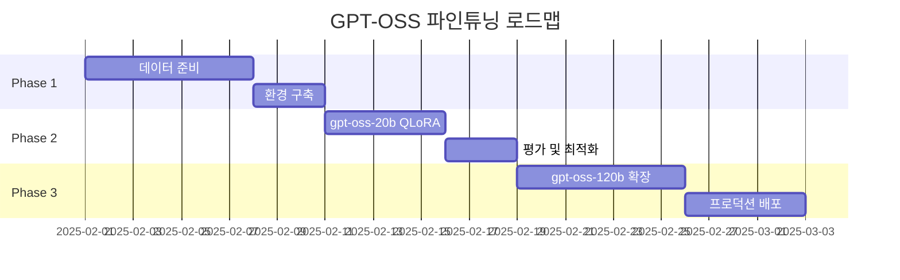

OpenAI GPT-OSS 모델의 파인튜닝 방안을 조사해보겠습니다.## 📚 **OpenAI GPT-OSS 파인튜닝 방안 - 수학 문항 자동분류 시스템**

### 1. **GPT-OSS 모델 개요 및 선택**

#### **모델 특성 비교**
```yaml
gpt-oss-20b:
  - 총 파라미터: 21B
  - 활성 파라미터: 3.6B/token
  - VRAM 요구사항: 16GB (MXFP4)
  - 장점: 소비자급 GPU 구동 가능
  - 추천 사용: 초기 프로토타입, 빠른 실험

gpt-oss-120b:
  - 총 파라미터: 117B  
  - 활성 파라미터: 5.1B/token
  - VRAM 요구사항: 80GB (MXFP4)
  - 장점: o4-mini 수준 성능
  - 추천 사용: 프로덕션, 고정확도 필요
```

**💡 추천**: 수학 문항 분류는 정확도가 중요하므로 **gpt-oss-20b로 시작**하여 프로토타입 개발 후, **gpt-oss-120b로 확장**

### 2. **파인튜닝 기법 선택**

#### **2.1 QLoRA (권장) vs LoRA 비교**

QLoRA는 4비트 양자화를 통해 LoRA 대비 메모리를 4배 절약하며, gpt-oss-20b의 경우 14GB VRAM에서 파인튜닝이 가능합니다. 

```python
# QLoRA 설정 (권장)
qlora_config = {
    "method": "QLoRA",
    "quantization": "4-bit NF4",
    "vram_required": {
        "gpt-oss-20b": "14GB",  # RTX 3090/4090 가능
        "gpt-oss-120b": "65GB"  # A100 80GB 필요
    },
    "training_speed": "LoRA 대비 39% 느림",
    "memory_savings": "70% 절약",
    "performance_loss": "거의 없음 (<1%)"
}

# LoRA 설정 (대안)
lora_config = {
    "method": "LoRA", 
    "precision": "16-bit",
    "vram_required": {
        "gpt-oss-20b": "~40GB",
        "gpt-oss-120b": "~200GB"
    },
    "training_speed": "빠름",
    "memory_savings": "50% 절약"
}
```

### 3. **데이터 준비 전략**

#### **3.1 Harmony 포맷 활용**

GPT-OSS는 OpenAI의 Harmony 응답 포맷으로 학습되었으며, thinking 필드와 content 필드를 구분하여 추론 과정을 명시적으로 처리합니다.

```python
# 수학 문항 분류용 데이터 포맷
training_example = {
    "messages": [
        {
            "role": "system",
            "content": """You are a Korean mathematics curriculum expert.
            Classify problems according to 2022 revised curriculum.
            Reasoning: medium"""  # 추론 수준 설정
        },
        {
            "role": "user",
            "content": "문항: 두 자리 수 45와 37의 합을 구하시오."
        },
        {
            "role": "assistant",
            "thinking": """이 문항을 분석해보면:
            1. 두 자리 수의 덧셈 문제
            2. 초등 1-2학년군 수준
            3. 수와 연산 영역
            4. 받아올림이 있는 덧셈
            5. 성취기준 [2수01-05] 해당""",
            "content": {
                "classification": {
                    "grade_level": "초1-2",
                    "domain": "수와 연산",
                    "achievement_standard": "[2수01-05]",
                    "achievement_level": "B",
                    "difficulty": 2,
                    "concepts": ["덧셈", "두 자리 수", "받아올림"]
                }
            }
        }
    ]
}
```

#### **3.2 데이터셋 구축 계획**

```python
dataset_plan = {
    "initial_dataset": {
        "source_1": "성취수준 843개 → GPT-4로 문항 생성",
        "source_2": "각 성취기준당 10개 변형 (1,810개)",
        "source_3": "교사 검증 문항 (500개)",
        "total": "약 3,000개 초기 데이터"
    },
    "augmentation": {
        "back_translation": "한→영→한 변환",
        "paraphrasing": "문제 표현 다양화",
        "difficulty_variation": "숫자/조건 변경"
    },
    "validation": {
        "train": "70% (2,100개)",
        "validation": "15% (450개)",
        "test": "15% (450개)"
    }
}
```

### 4. **파인튜닝 구현 코드**

#### **4.1 환경 설정**

```bash
# 필수 라이브러리 설치
pip install transformers==4.45.0
pip install trl==0.11.0
pip install peft==0.13.0
pip install bitsandbytes==0.44.0
pip install triton==3.4
pip install accelerate
pip install unsloth  # 최적화된 학습
```

#### **4.2 QLoRA 파인튜닝 스크립트**

```python
import torch
from transformers import AutoModelForCausalLM, AutoTokenizer
from peft import LoraConfig, get_peft_model, prepare_model_for_kbit_training
from trl import SFTTrainer, DataCollatorForCompletionOnlyLM
import bitsandbytes as bnb

# 1. 모델 로딩 (4비트 양자화)
model_name = "openai/gpt-oss-20b"

bnb_config = BitsAndBytesConfig(
    load_in_4bit=True,
    bnb_4bit_quant_type="nf4",
    bnb_4bit_compute_dtype=torch.bfloat16,
    bnb_4bit_use_double_quant=True,  # 이중 양자화
)

model = AutoModelForCausalLM.from_pretrained(
    model_name,
    quantization_config=bnb_config,
    device_map="auto",
    trust_remote_code=True,
)

tokenizer = AutoTokenizer.from_pretrained(model_name)

# 2. LoRA 설정
lora_config = LoraConfig(
    r=32,  # rank (8-64 범위, 높을수록 성능↑ 메모리↑)
    lora_alpha=64,  # scaling factor
    target_modules=[
        "q_proj", "v_proj", "k_proj", "o_proj",
        "gate_proj", "up_proj", "down_proj"
    ],  # MoE 구조 고려
    lora_dropout=0.05,
    bias="none",
    task_type="CAUSAL_LM",
)

# 3. 모델 준비
model = prepare_model_for_kbit_training(model)
model = get_peft_model(model, lora_config)

# 4. 학습 설정
training_args = TrainingArguments(
    output_dir="./math-classifier-gpt-oss",
    num_train_epochs=3,
    per_device_train_batch_size=2,
    gradient_accumulation_steps=8,
    learning_rate=2e-4,
    warmup_steps=100,
    logging_steps=25,
    save_strategy="steps",
    save_steps=500,
    evaluation_strategy="steps",
    eval_steps=100,
    fp16=True,
    gradient_checkpointing=True,  # 메모리 절약
    optim="paged_adamw_8bit",  # 8비트 옵티마이저
    max_grad_norm=0.3,
    warmup_ratio=0.03,
    group_by_length=True,
    lr_scheduler_type="cosine",
)

# 5. Harmony 포맷 처리
def format_math_problem(example):
    """수학 문항을 Harmony 포맷으로 변환"""
    messages = [
        {
            "role": "system",
            "content": "한국 2022 개정 수학과 교육과정 분류 전문가\nReasoning: medium"
        },
        {
            "role": "user", 
            "content": f"문항: {example['problem']}"
        },
        {
            "role": "assistant",
            "thinking": example['reasoning'],  # 추론 과정
            "content": example['classification']  # 최종 분류
        }
    ]
    
    # Harmony 라이브러리 사용
    from harmony import encode_conversations_with_harmony
    return encode_conversations_with_harmony(
        messages,
        reasoning_effort="medium",
        add_generation_prompt=False
    )

# 6. 트레이너 설정
trainer = SFTTrainer(
    model=model,
    args=training_args,
    train_dataset=train_dataset,
    eval_dataset=eval_dataset,
    tokenizer=tokenizer,
    peft_config=lora_config,
    dataset_text_field="text",
    max_seq_length=2048,
    packing=False,
    formatting_func=format_math_problem,
)

# 7. 학습 실행
trainer.train()
```

### 5. **최적화 전략**

#### **5.1 메모리 최적화**

Unsloth를 사용하면 gpt-oss 파인튜닝이 1.5배 빠르고 70% 적은 VRAM을 사용하며, 10배 긴 컨텍스트를 지원합니다.

```python
# Unsloth 최적화 사용
from unsloth import FastLanguageModel

model, tokenizer = FastLanguageModel.from_pretrained(
    model_name="unsloth/gpt-oss-20b-bnb-4bit",
    max_seq_length=2048,
    dtype=None,
    load_in_4bit=True,
)

# Flash Attention 2 활성화
model = FastLanguageModel.get_peft_model(
    model,
    r=32,
    target_modules=["q_proj", "k_proj", "v_proj", "o_proj",
                    "gate_proj", "up_proj", "down_proj"],
    lora_alpha=64,
    lora_dropout=0,
    bias="none",
    use_gradient_checkpointing="unsloth",
    random_state=3407,
    use_rslora=False,
    loftq_config=None,
)
```

#### **5.2 하이퍼파라미터 최적화**

```python
hyperparameter_grid = {
    "rank_r": [8, 16, 32, 64],  # 복잡도에 따라 조정
    "learning_rate": [1e-4, 2e-4, 5e-4],
    "batch_size": [1, 2, 4],  # VRAM에 따라
    "gradient_accumulation": [4, 8, 16],
    "reasoning_effort": ["low", "medium", "high"],  # GPT-OSS 특성
}

# 최적 설정 (실험 기반)
optimal_config = {
    "r": 32,
    "lora_alpha": 64,  # 일반적으로 r*2
    "learning_rate": 2e-4,
    "batch_size": 2,
    "gradient_accumulation_steps": 8,
    "epochs": 3,
    "warmup_ratio": 0.1,
}
```

### 6. **평가 및 배포**

#### **6.1 평가 메트릭**

```python
def evaluate_classifier(model, test_dataset):
    metrics = {
        "accuracy": {
            "overall": 0.0,
            "by_grade": {},
            "by_domain": {},
            "by_achievement_standard": {}
        },
        "f1_score": {},
        "confusion_matrix": {},
        "inference_time": [],
        "confidence_calibration": {}
    }
    
    # Chain of Thought 품질 평가
    cot_quality_metrics = {
        "reasoning_coherence": 0.0,
        "step_completeness": 0.0,
        "conclusion_accuracy": 0.0
    }
    
    return metrics
```

#### **6.2 모델 병합 및 배포**

```python
# LoRA 어댑터 병합
from peft import PeftModel

# 베이스 모델 로드
base_model = AutoModelForCausalLM.from_pretrained(
    "openai/gpt-oss-20b",
    torch_dtype=torch.bfloat16,
    device_map="auto"
)

# LoRA 어댑터 로드 및 병합
model = PeftModel.from_pretrained(base_model, "./math-classifier-gpt-oss")
model = model.merge_and_unload()

# 저장
model.save_pretrained("./gpt-oss-math-classifier-merged")
```

### 7. **프로덕션 고려사항**

#### **7.1 서빙 아키텍처**

```yaml
deployment_options:
  vLLM:
    - 고성능 추론 서버
    - OpenAI 호환 API
    - 배치 처리 최적화
    
  Triton_Server:
    - 멀티 모델 서빙
    - 동적 배칭
    - 모델 버전 관리
    
  TGI (Text Generation Inference):
    - Hugging Face 네이티브
    - 자동 양자화
    - 스트리밍 지원
```

#### **7.2 비용 분석**

```python
cost_estimation = {
    "training": {
        "gpt-oss-20b_qlora": {
            "gpu": "RTX 4090 (24GB)",
            "time": "~6시간",
            "cost": "$30 (클라우드)"
        },
        "gpt-oss-120b_qlora": {
            "gpu": "A100 80GB",
            "time": "~24시간", 
            "cost": "$500 (클라우드)"
        }
    },
    "inference": {
        "gpt-oss-20b": "~$0.001/request",
        "gpt-oss-120b": "~$0.005/request"
    }
}
```

### 8. **실행 로드맵**



### 9. **예상 성과**

- **정확도**: 85-92% (성취기준 분류)
- **처리 속도**: 100-200ms/문항
- **비용 절감**: 상용 API 대비 90% 절감
- **확장성**: 온프레미스 배포 가능

이 방안은 GPT-OSS의 강력한 추론 능력과 한국 수학 교육과정의 특성을 결합하여, 효율적이고 정확한 문항 자동분류 시스템을 구축할 수 있는 실용적 접근법입니다.