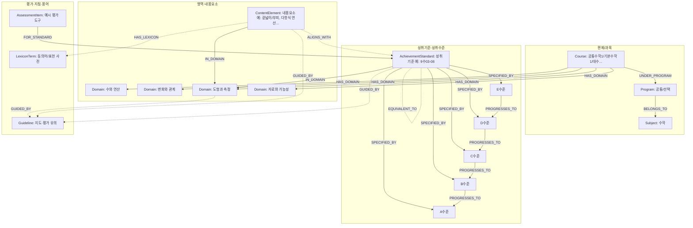

버전: GPT-5 · 2025-08-29 (Asia/Seoul)

팀장님, 아래는 **교육과정 기반 지식체계**를 한눈에 보는 **Mermaid 시각화 다이어그램**입니다. 바로 복사해 Mermaid Live Editor 등에 붙여 보실 수 있습니다.

---

## 1) 스키마(전체 구조) 다이어그램



---

## 2) 예시 인스턴스 다이어그램(도형·겉넓이/부피)

```mermaid
graph TD
  %% 노드
  SUB[수학]
  PROG[선택 중심]
  COURSE[공통수학1]
  DOM3[도형과 측정 (03)]
  CE1[내용요소: 겉넓이/부피]
  STD1[성취기준: 9수03-08<br/>"기둥·뿔·구의 겉넓이와 부피를 구할 수 있다"]
  L_A[A수준: 과정 설명/일반화]
  L_C[C수준: 과정을 이해하고 구함]
  L_E[E수준: 일부만 계산]
  AS1[예시평가: 원뿔 부피 구하기]
  GL1[지침: 복잡 계산 시 계산기 허용·과정 설명 요구]
  LEX1[용어사전: 겉넓이=표면적/surface area]
  STD2[9수02-09: 다항식 덧셈/뺄셈]
  STD3[9수02-10: (단항×다항)/(다항÷단항)]
  STD4[9수02-19: 인수분해]

  %% 구조적 관계
  PROG -->|BELONGS_TO| SUB
  COURSE -->|UNDER_PROGRAM| PROG
  COURSE -->|HAS_DOMAIN| DOM3
  CE1 -->|IN_DOMAIN| DOM3
  STD1 -->|IN_DOMAIN| DOM3
  STD1 -->|SPECIFIED_BY| L_A
  STD1 -->|SPECIFIED_BY| L_C
  STD1 -->|SPECIFIED_BY| L_E
  AS1 -->|FOR_STANDARD| STD1

  %% 추론 관계
  CE1 -. ALIGNS_WITH .-> STD1
  L_E -->|PROGRESSES_TO| L_C -->|PROGRESSES_TO| L_A
  DOM3 -. GUIDED_BY .-> GL1
  CE1 -. HAS_LEXICON .-> LEX1

  %% 위계/전제 예시(대수 위계)
  STD2 -. PREREQ .-> STD3 -. PREREQ .-> STD4
```

---

## 3) 예시 인스턴스 다이어그램(유리수 대소관계)

```mermaid
graph TD
  DOM1[수와 연산 (01)]
  CE2[내용요소: 유리수의 대소관계/절댓값]
  STD5[성취기준: 9수01-03<br/>"유리수의 대소관계를 이해하고 표현"]
  STD6[성취기준: 9수01-04<br/>"절댓값의 의미와 활용"]
  L_C[C수준: 기본 계산/비교]
  L_D[D수준: 단순 판단]
  LEX2[용어사전: 절댓값 ↔ | |]
  AS2[예시평가: 옳은 부등호 고르기]

  CE2 -->|IN_DOMAIN| DOM1
  STD5 -->|IN_DOMAIN| DOM1
  STD6 -->|IN_DOMAIN| DOM1

  CE2 -. ALIGNS_WITH .-> STD5
  CE2 -. ALIGNS_WITH .-> STD6
  STD5 -->|SPECIFIED_BY| L_C
  STD5 -->|SPECIFIED_BY| L_D
  AS2 -->|FOR_STANDARD| STD5
  CE2 -. HAS_LEXICON .-> LEX2
```

---

필요하시면 이 Mermaid를 기반으로 **역량(문제해결·추론·의사소통 등) 레이어**나 **승인상태/신뢰도(confidence) 배지**까지 표시한 확장 버전도 그려드리겠습니다, 팀장님.
