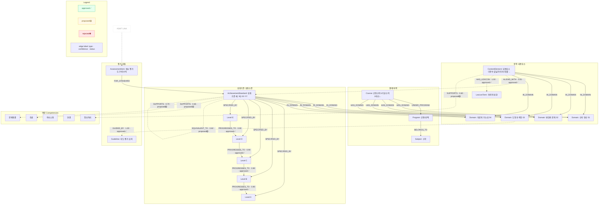
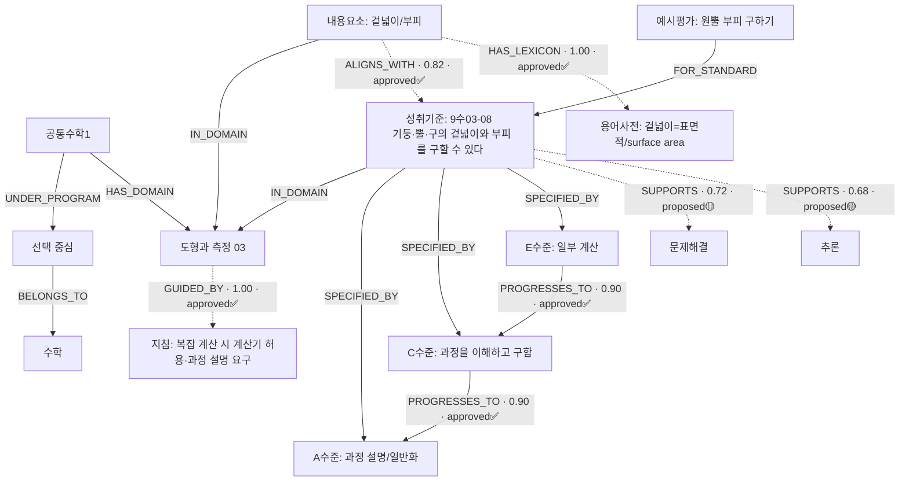
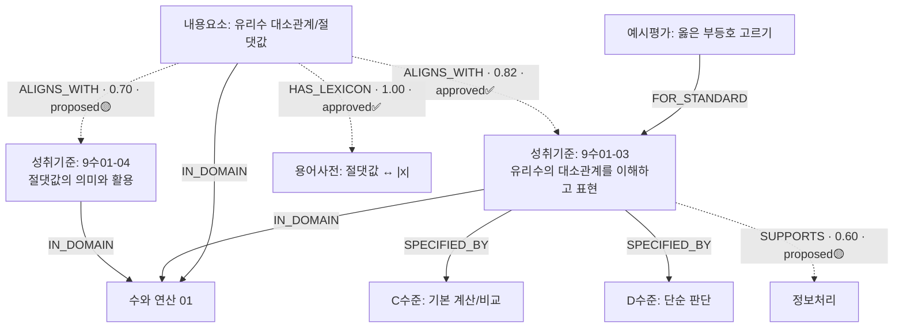

버전: GPT-5 · 2025-08-29 (Asia/Seoul)

팀장님, 요청하신 **확장 버전 Mermaid 다이어그램**입니다.
아래에는 (1) 전체 스키마 확장(역량/상태/신뢰도/Evidence 레이어 포함), (2) 도형-겉넓이/부피 인스턴스(신뢰도·승인상태 배지), (3) 유리수 대소관계 인스턴스까지 준비했습니다.
그대로 복사해 **Mermaid Live Editor**에서 보시면 됩니다.

---

## 1) 전체 스키마(확장형: 역량·상태·신뢰도·Evidence 포함)

---

## 2) 인스턴스: 도형—겉넓이/부피(신뢰도·상태 배지 포함)

---

## 3) 인스턴스: 유리수 대소관계(후보 2개 & 승인상태 혼재)

---

### 사용 팁

* Mermaid Live Editor에서 **다크 모드**나 **fontSize** 옵션을 조정하면 가독성이 좋아집니다.
* 라벨에 표기한 `type · confidence · status`는 실제 운영 값으로 자동 치환되도록 템플릿화할 수 있습니다(예: `{{edge.type}} · {{edge.confidence}} · {{edge.status}}`).
* 필요하시면 **상태별 색상**을 더 강조(굵기/테두리)하는 버전이나, **증거(evidence) 인용 스니펫**을 툴팁(popover)로 노출하는 HTML 확장 버전도 만들어드리겠습니다, 팀장님.
